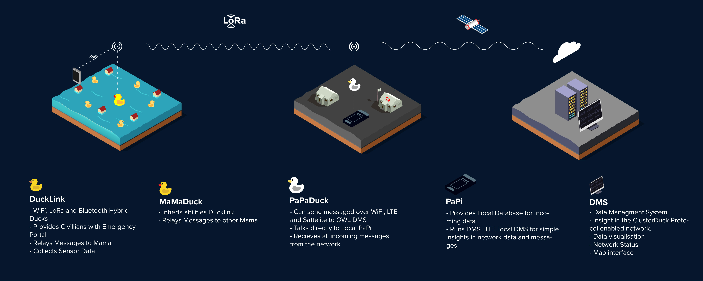
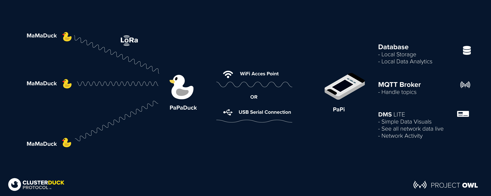
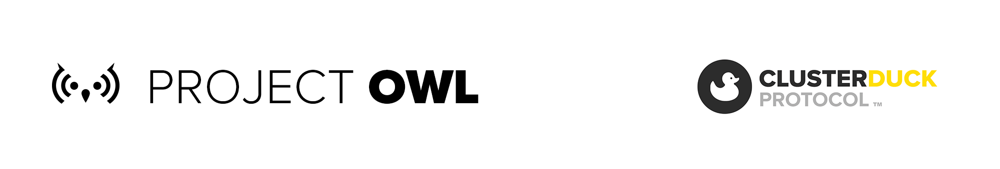

 
 
## About
The PaPi and DMS LITE is a collaborative effort to collect all the data from a [ClusterDuck Protocol](https://github.com/Code-and-Response/ClusterDuck-Protocol) network locally. It provides a local interface to see network activity and data traffic. The PaPi was brought to life for areas when there is no internet connection available at all. The PaPi can store data and act as a local MQTT broker to communicate with the PaPa Duck. 

## How it Works
There are two different ways to get your data into the PaPi: using a USB Serial connection or WiFi. Using the serial connection, the Raspberry Pi reads the incoming messages from the serial monitor by a wired connection from the papaduck and writes the data into the database. Using the Wifi connection the Raspberry pi turns into an acces point. This allows the Papa Ducks to send data over WiFi to a MQTT broker that writes the data into the database.

### DMS LITE
The DMS LITE is the open source version of the cloud DMS. DMS LITE gives you simple network activity and data visuals.

The PaPa Duck is running a different Firmware than the regular ClusterDuck Protocol PaPa example.

### Example of ClusterDuck Protocol Network

### Local ClusterDuck Protocol Network

## Parts required

- Raspberry Pi (3B+ preffered)
   - for using a pi zero you need a different setup for node.js
- Micro SD-Card 16GB or more
  - Raspbian OS installed
- Mouse and Keyboard
- Monitor
- Wired Ethernet Connection

- Latest Copy of [ClusterDuck Protocol](https://github.com/Code-and-Response/ClusterDuck-Protocol)

# Setup 
## How To Install
The PaPi and DMS LITE both need some setup before you can start seeing your data. To turn the Raspberry Pi into the PaPi, you will need to install multiple modules. 

## Prepare Heltec or TTgo Board for PaPi
1. Goto [PAPI DMS Lite Examples](https://github.com/Call-for-Code/ClusterDuck-Protocol/tree/master/examples/6.PaPi-DMS-Lite-Examples "DMS PAPI Examples")
2. Select which example you need based off of your particular install
3. Upload the .INO and you are set to move on 

## Script Install 
Both Raspbian images have Python 2 preinstalled but Raspbian Lite does not have python 3 preinstalled. But you will need to set you Pi to use python 3 as default. We recommend using the latest release of [Rasbian Desktop with recommened software](https://www.raspberrypi.org/downloads/raspberry-pi-os/).

1. Check your python version by running: `python --version`
  *** if you don't see python 3 continue on to 2.**
2. `nano ~/.bashrc` 
3. Add this to the very bottom: `alias python='/usr/bin/python3'`
4. Close terminal and open a new one
5. Try `python --version` and you should see your default is python 3

#### For Usb Serial 
1. Connect the LoRa board to the Raspberry Pi
2. `chmod u+x serial-install.sh` will make the code excutable 
3. `./Serial-install.sh` will make the code run 
4. Sit back and kick up your feet because install will take a bit

The DMS Lite will automatically open in a full sized window.

#### After Install Run
The next time you boot the Pi CD into the DMS-LITE folder and run the following script.
1. `chmod u+x run.sh`
2. Now that you made the script executable run it by typing: `./run.sh`
*** This will launch the scripts and bring you into kiosk mode. Which is full screen full resolution with no bars or anything. to exit out of this either reboot the pi or press fn f4 key to get back to desktop. ***

In your Browser go to Localhost:3000 to see the dms-lite

NOTE: *You need to run the two scripts in two separate terminals.*

#### For Wifi Acces Point 
1. `chmod u+x Wifi-install.sh` will make the code excutable 
2. `./Wifi-install.sh` will make the code run 
3. sit back and kick up your feet because install will take a bit

NOTE: *You need an Internet Connection to install the packages and the DMS LITE application. After the Raspberry Pi is turned into an Access Point it doesn't have WiFi capabilities anymore and you will need a LAN connection for final setup.*

After you have installed the required dependencies you can the two scripts.

`python3 Wifi_sqlwriter.py`

`npm run start`

In your Browser go to Localhost:3000 to see the dms-lite

NOTE: *You need to run the two scripts in two separate terminals.*

